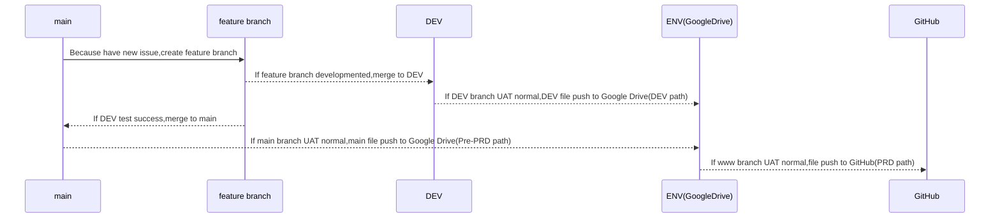

# Web

 - ***簡略說明此專案資訊***
	 - 
	 - 此專案主要負責個人網頁  
	 
 - 網頁版本分類:
	 - 
	 - PRD(正式環境):[URL](https://eric19960129.github.io/Web/index.html)
	 - Pre-PRD(初步正式環境):[URL](https://wwwhomegatewayhsuhomemyweb.on.drv.tw/myWeb/PRD/)
	 - DEV(開發環境):[URL](https://wwwhomegatewayhsuhomemyweb.on.drv.tw/myWeb/DEV/)  

 - 網頁架設:
	 - 
	 - 目前檔案存放於Google Drive利用[DriveToWeb](https://www.drv.tw/)架設個人網站
	 - Pre-PRD、DEV環境架設於同一個雲端硬碟，利用資料夾做區分
	 - PRD環境架設於GitHub，利用公開網域的方式，提供使用  

 - 目前Git上版流程
	 - 
		詳細請閱讀流程圖

  

 - 管理專案項目
 	 - 
	 - 主要管理各項目
	 	- [Trello](https://trello.com/b/aGtJwNkU/myweb)
		- 所有ISSUE歸類
 	 - FEATURE
	 	- BranchName:FTURE-XXXX1
		- Item:Create new issue for [Jira](https://eric19960129.atlassian.net/jira/core/projects/MYW/board)
		- 未來改變的目標
 	 - ISSUE
	 	- BranchName:ISSUE-XXXX1
		- Item:Create new issue for gitLab
		- 不影響整體運作，才開的ISSUE
	 - DEBUG
	 	- BranchName:DEBUG-XXXX1
		- Item:Create new issue for [Taiga](https://tree.taiga.io/project/eric19960129-mywebschedule/timeline)
		- 影響整體運作，才開的ISSUE  

 - RobotFramework
 	 - 
	 - 測試檔案位置
	 	- /robot
	 - 隱藏測試時產生git commit change的檔案問題，利用.gitignore來忽視
	 	- 位置:根目錄/.gitignore
 	 - 測試指令
		- robot --output ./logInfo/output.xml  --log ./logInfo/log.html --report ./logInfo/report.html test.robot
		- --output 產生output檔案位置
		- --log    產生log檔案位置
		- --report 產生report檔案位置  

 - 基礎Git Q&A指令
	 - 
	 - Q: 當需要創建新的branch來源參考main並切換到新分支，指令為何?
	 - A:
		 - **git checkout main** (先切到main branch)
		 - **git pull** (讓main branch拉取最新資料)
		 - **git checkout -b bname main** (bname為建立新的分支名稱來源為main)
	 - Q: 當遠端分支已經刪除，需要本地端同步，並刪除本機端不要的分支，指令為何?
	 - A:
		 - **git checkout main** (先切到main branch)
		 - **git pull** (讓main branch拉取最新資料)
		 - **git fetch --prune** (本機端存在遠端分支更新，自動同步遠端存在分支)
		 - **git branch -d bname** (本地留存的遠端暫存分支須清除，上面不會清除)  

 - 參考工具
	 - 
	 - Markdown線上編譯:[URL](https://stackedit.io/)
